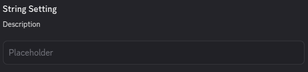
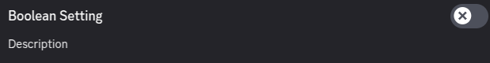
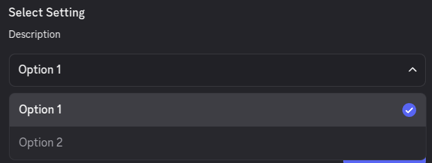
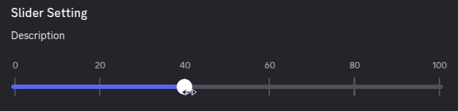

Here are the various option types that are available for you to use, along with their specific properties.

## Common

You will find yourself using these setting types the most frequently.

### String

Use the string type for text values.

```json
settingName: {
    type: OptionType.STRING,
    placeholder: "Optional example value that will be shown if setting is unset",
    default: "Sensible default value for that setting. Optional"
}
```



### Number

Use the number type for numeric values. Visually, it looks the same as the string type, but has validation to make sure that only a number is entered.

```json
settingName: {
    type: OptionType.NUMBER,
    placeholder: "Optional example value that will be shown if setting is unset",
    default: 1 // Sensible default value for that setting. Optional 
}
```

### BigInt

Use the number type for numeric values **that do not fit in an integer**. You might need this type to store Discord user/channel/guild IDs or similar
large values. If you do not need that, use the `NUMBER` type. Visually, it looks the same as the string type, but has validation to make sure that only a number is entered.

```json
settingName: {
    type: OptionType.BIGINT,
    placeholder: "Optional example value that will be shown if setting is unset",
    default: 1015060230222131221n // Sensible default value for that setting. Optional 
}
```

### Boolean

Use the boolean type for toggles, and more generally, true/false values.

```json
settingName: {
    type: OptionType.BOOLEAN,
    default: true/false // Sensible default value for that setting. Optional
}
```



### Select

Use the select type to show multiple pre-defined options. It is highly recommended that you set a default value for a better user experience.

```json
settingName: {
    type: OptionType.SELECT
    options: [
        {
            label: "Option 1",
            value: "option1",
            default: true
        },
        {
            label: "Option 2",
            value: "option2",
        }
    ]
}
```



:::tip
Notice how we pass `default: true` to the default setting. 

Also, the `label` will be shown to the user, while the `value` will be returned when accessing the
setting from your plugin.
:::

### Slider

Use the select type to show multiple pre-defined options. If you do not set a default value, it will be set to `0`.

```json
settingName: {
    type: OptionType.SLIDER
    markers: [0, 20, 40, 60, 80, 100],

    // Forces user to stick to the markers.
    // If false, allows them to set a value between.
    stickToMarkers: true/false
}
```



## Advanced

If you'd like to have a custom UI for a specific setting, or store an internal setting, you will need these types.

### Custom

Custom settings can store absolutely anything and are not displayed in the settings UI. They can only be set programmatically.

```json
settingName: {
    type: OptionType.CUSTOM
}
```

### Component

With the component type, you can show a fully customizable React component. You can set the setting's value programmatically 
in case you need to associate data to it.

```tsx
settingName: {
    type: OptionType.COMPONENT,
    component: () => <>
        <Button>Here is a button</Button>
    </> // This must be a function that returns a React component.
}

